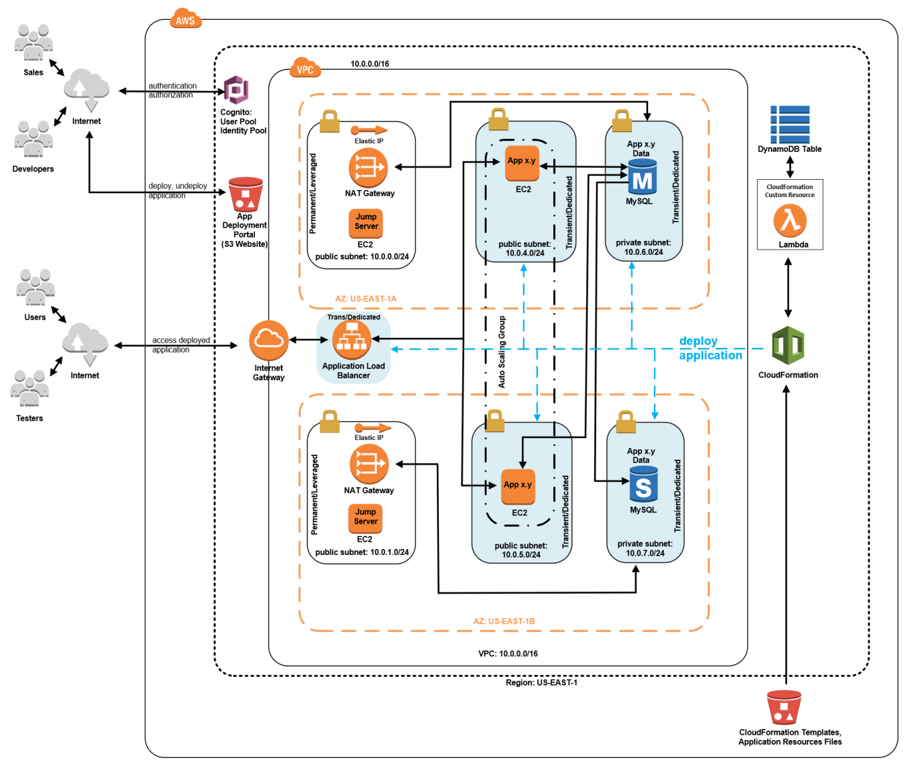
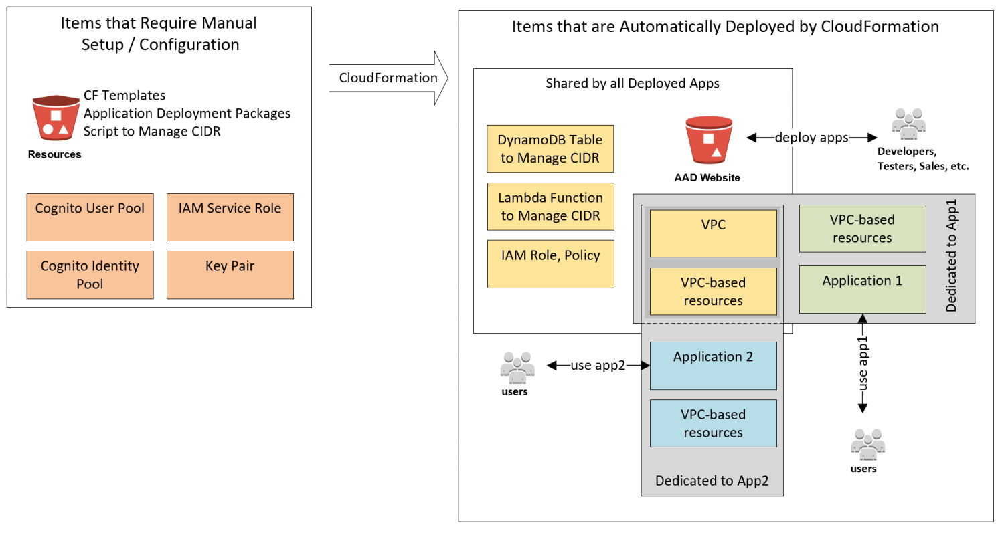
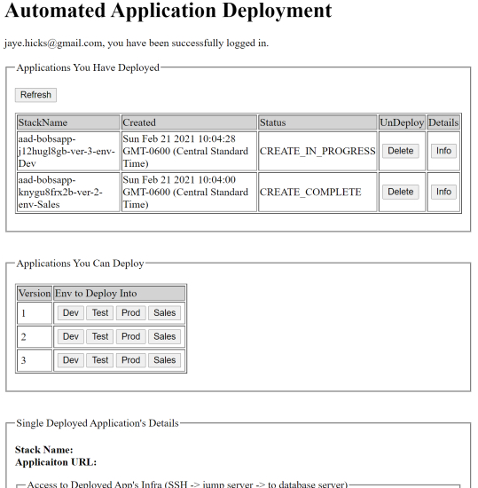
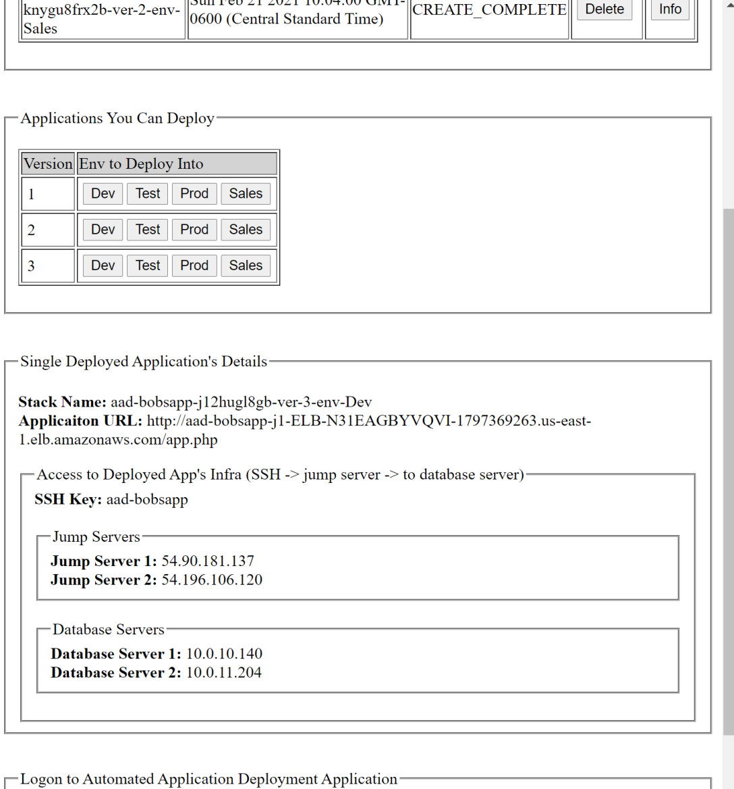

# Introduction
This repository contains source materials that will enable you to bring up a well-architected solution (see diagram above) that automates the deployment / update / undeployment of LAMP (Linux/Apache/MySQL/PHP) application stacks into a single AWS VPC.  All deployed LAMP application stacks share a single Internet Gateway and two public subnets, each containing a jump server and a Network Address Translation (NAT) Gateway to facilitate the administration of database servers located in the dedicated private subnets of LAMP application stacks.  Each deployed LAMP application stack is provisioned additional dedicated infrastructure: Application Load Balancer, Auto Scaling Group (for web servers), and four subnets.  Two of these four dedicated subnets are public (i.e., web servers) and two are private (i.e., database servers).

A preliminary step must be taken, to provision and configure supporting AWS infrastructure, before the solution can operate properly.  Following the preliminary step, an Automated Application Deployment (AAD) single page web application (makes AWS CloudFormation API calls) controls the automated deployment / undeployment of LAMP application stacks into a shared VPC. 

This repository provides AWS CloudFormation templates for the preliminary, one-time step provisioning and configuring of supporting infrastructure required by the AAD application.  In addition, it contains source code and necessary resources for the AAD application.  Included with these resources are an AWS CloudFormation template, a Python 3.8 script (that manages the assignment of CIDR blocks to deployed LAMP application stacks), and a collection of simple LAMP application deployment packages that the AAD application can deploy / undeploy.  The deployment packages are provided for demonstrative purposes only.  The AAD application is capable of deploying / undeploying virtually any application with little to no modification. 

The guidance provided in this repository is targeted towards experienced solutions architects possessing AWS experience.  To assist more entry level resource, that might have very little AWS experience, I have included the “combined.doc” document.  I sanitized and combined multiple documents from a 2018 consulting engagement to create the document.  While I spent some effort updating content, I did not revisit the prescriptive, detailed guidance sections which was generated in early 2018 and is no longer in synch with the current AWS console.

# Context for Solution Development
In late 2020 I repurposed work, that was delivered years earlier to a different client, related to automated application deployment into AWS.  After genericizing and enhancing my original work, I realized that the CloudFormation component of what I assembled was something that could be useful, or at least instructive, to some.  So, I segmented off the CloudFormation portion, scrubbed out client-specific detail, and created this repository. 

I have a solid understanding of the AWS CloudFormation service.  However, I am not a deeply experienced CloudFormation resource that has worked in the service, on a daily basis, for an extended period of time.  Nor am I a Linux SME or a PHP expert.  All of the material contained in this repository is original work, however, for some elements of the solution’s design I drew inspiration from public domain material that I encountered while conducting on-line CloudFormation research.

# Overview


This repository contains the AAD single page web application, AWS CloudFormation templates, a Python 3.8 module, a collection of LAMP application deployment packages, and a supporting document.  The AAD application interacts with the AWS CloudFormation service to deploy / undeploy LAMP application stacks into AWS infrastructure (combination of shared and dedicated AWS infrastructure).  

The AWS CloudFormation templates can be classified into two groups: 
* Supporting Infrastructure
   *  master-cf-process.yaml
   * shared-infrastructure.yaml
   * portal-website.yaml
   * cidr-assignment.yaml
* LAMP Application Stack Deployment / Undeployment
   * app-infrastructure.yaml

The diagram above represents a high-level, logical view of the solution contained in this repository.  After you have manually provisioned and configured a few pieces of supporting infrastructure (i.e., light-orange boxes in diagram above) you can execute a CloudFormation template (i.e., master-cf-process.yaml) that will provision and configure the rest of the supporting infrastructure (i.e., yellow boxes in diagram above).  With the previous two steps completed you can manually upload two files into an S3 bucket (i.e., provisioned in the second step) at which point the AAD application will be fully operational and can be used to deploy / undeploy LAMP application stacks.  After authenticating (i.e., AWS Cognito user id / pw) with the AAD application, a user can deploy / undeploy LAMP application stacks (i.e., green boxes for application 1 and blue boxes for application 2).  LAMP applications deployed by the AAD application leverage both dedicated resources (blue or green boxes) and resources shared by all deployed applications (yellow boxes).  End users directly interact with the deployed LAMP applications, they do not interact with the AAD application in any way.

This solution offers several advantages.  First, the deployment / undeployment of LAMP application stacks is automated thereby improving efficiency and accuracy.  The automated undeployment of LAMP application stacks avoids the potential for erroneously orphaned EC2 instances and NAT Gateways, which accrue hourly EC2 charges.  Additionally, cost savings are realized as each deployed LAMP application stacks shares a single VPC, IGW, and pair of NAT Gateways instead of provisioning dedicated resources.    

The solution provides flexibility with respect to the deployment of applications.  The number of applications that can run concurrently is a function of the availability of CIDR blocks within the VPC.  CIDR block assignment is managed automatically to ensure complete access to the VPC’s full address range.  Multiple versions of a given application can be launched and individual application can be launched into different environment types (e.g., development, test, production).  These environment types can be individually configured, using CloudFormation template maps, to the appropriate resource level.  In the CloudFormation template responsible for launching LAMP application stacks, two maps are used to specify the AMIs (i.e., Amazon Machine Image - OS and pre installed software packages) and instance types (i.e., server sizes) of servers.





The screen capture above is of the AAD application.  It illustrates one successfully deployed LAMP application stack and one LAMP application stack in the process of being deployed.





The screen capture above is from the AAD application.  It illustrates the result of user action to display the detail behind a deployed LAMP application stack.

The solution contained in this repository is but one of many different approaches that an individual could take to automate the deployment / undeployment of applications into AWS.  As it is based on AWS CloudFormation, it provides detailed  access / control of practically all aspects of almost every AWS service.  However, the solution is less capable than other approaches relative to application build / deploy / manage that would be based on orchestration tools and / or configuration management tools.

A few alternatives to the CloudFormation based solution contained in this repository include: 
* AWS Elastic Beanstalk
  * Great approach if you have a development team that you would like to cut loose, giving them control over their development environment
  * If you have cost concerns there are many ways to address them.  A few that come to mind
      * Create a separate AWS account for the development team
      * Employ AWS Service Catalogue
      * AWS CloudWatch Alarm to track projected monthly bill
      * IAM Permission Boundaries (i.e., restrict access to expensive infrastructure)
* AWS OpsWorks
  * Good option if you need the functionality provided by a full-featured Configuration Management tool
  * Within this service you can select between three different versions
     * OpsWorks Stacks – basic; functionality originally offered by the OpsWorks service
     * OpsWorks for Chef Automate
     * OpsWorks for Puppet Enterprise
* Deploy your own custom AWS infrastructure (i.e., VPC and EC2 instances) and run the application deployment software of your choice (e.g., SALT). Also, there is a large number of active vendors in the AWS market place and you may be able to find the application of your choice running in a SaaS model.
* AWS Developer Tool Suite.
  * This is a great choice if your developers are developing AWS-based solutions and are conducting development activities on AWS.  The tools in this suite are integrated with each other and have value-added, deep integrations with several of the more important AWS services.
  *Tools
    * CodeStar – manage software development activities
    * CodeCommit – repository
    * CodeArtifat – store, share, leverage software packages
    * CodBuild – compile, test, and produce software pacakges
    * CodeDeploy – deploys software to AWS and on premises destinations
    * CodePipeline – create your own CI / CD tool chain
    * Cloud9 – IDE
* For serverless applications you could leverage AWS’ SAM and / or AWS’ SAR
  * Serverless Application Model (SAM) is an extension to CloudFormation for serverless applications
  * Serverless Application Repository (SAR) is an AWS managed repository where you can upload serverless applications that are built/packaged and ready for you to deploy on AWS infrastructure
  * For my two consulting engagements, related to this repository, the client was specifically interested in the automated launching of LAMP applications into AWS  
  * I have architected, developed, and deployed serverless applications into AWS for clients.  However, in all cases, application deployment was a straight forward, uncomplicated, single event.  As such, I decided not to not complicate things by gratuitously introducing CloudFormation+SAM and / or AWS Serverless Application Repository.

# The Solution in Detail
It is worth noting, again, that there are two separate applications contained in this repository: the AAD single page web application and a collection of simple LAMP applications.  Refer to the initial paragraph of the Security section for more detail.

The guidance provided in this repository is targeted towards experienced solutions architects possessing AWS experience.  To assist more entry level resource, that might have very little AWS experience, I have included the “combined.doc” document.  I sanitized and combined multiple documents from a 2018 consulting engagement to create the document.  While I spent some effort updating content, I did not revisit the prescriptive, detailed guidance sections which was generated in early 2018 and is no longer in synch with the current AWS console.

## Regions
This solution contained in this repository is a single region solution.  It does not handle deploying applications across multiple AWS regions nor does it handle applications that have a multi AWS region architecture.  There is nothing inherent in the solution that precludes you from extending it to accommodate your own multi region requirements.

## Security
There are two separate, unrelated applications contained in this repository.  The first is the Automated Application Deployment (AAD) application.  It is a single page web application that deploys / undeploys the second application (i.e., LAMP applications) contained in this repository.  All of the information contained in this security section, as well as all of the security information contained throughout this entire README.md document, pertains to the AAD application.  

The second application referenced in this repository is really a collection of simple, individual LAMP applications.  Their sole purpose in this repository is to provide the AAD application something to deploy / undeploy.  These applications are all identical except for the contents of the web page file and the test pattern file.  The applications themselves do nothing more than display a single, static web page.  However, it should be noted that each application stack deployment involves provisioning a fully functional set of supporting AWS infrastructure (e.g., subnets, database servers).  Nothing contained in this repository addresses securing end user access to these simple LAMP applications.  The sole purpose of these applications in this repository is to provide the AAD application something to deploy / undeploy. 

### Access to the Deployed LAMP Applications
End users of the LAMP applications access them directly; they do not traverse through the AAD application to do so.  Nothing in this repository addresses end user authorization / authentication for the LAMP applications.

### Access to  the AAD Application
End user access to the AAD Application is facilitated by the AWS Cognito service utilizing a user pool and an identity pool.  See the Cognito section below for more detail.

### Authority to Execute CloudFormation Templates
If an IAM service role is not in place, the access level of the IAM user (logged into the AWS console or using the CLI) or of the temporary IAM credentials provided by STS (e.g., invoke AWS APIs via SDK) will determine if a CloudFormation template can be executed.  If a CloudFormation template can be executed, the ability for the template to provision and configure resources, as prescribed by the template, is determined by the access level of the IAM user or of the temporary IAM credentials provided by STS.

IAM service roles provide an efficient and secure manner to grant individual IAM users, as well as non IAM users (e.g., AAD application end users authenticated by an AWS Cognito User Pool), the ability to successfully execute a given CloudFormation template(s).  In a IAM service role you can package all permission levels necessary to provision and to configure the AWS resources prescribed by the template.  So, with the necessary permission levels for successfully executing a given CloudFormation template(s) handled by the IAM service role the only remaining security requirement is to grant permission to an IAM user, or to temporary IAM credentials generated by STS, the use of the CloudFormation service in order to execute the template(s).

In the solution provided in this repository, CloudFormation templates are executed at two distinctly different times. The first is the initial, one-time provisioning / configuration of the AWS infrastructure that supports the AAD application and the deployed LAMP applications.  The invocation of CloudFormation templates for this initial, one-time step should be conducted by an IAM user, who has AdministratorAccess level permission, using the CloudFormation section of the AWS Console.

The second time that CloudFormation templates are executed by this solution is when the AAD application deploys / undeploys a LAMP application stack.  The AAD application secures permission to execute CloudFormation templates by the virtue of the end user (i.e., user of the AAD application) having been previously logged into an AWS Cognito User Pool.  The authenticated users in this Cognito User Pool are allowed to assume an IAM role that allows them to execute a CloudFormation template as well as pass an IAM role,  (‘AutoAppDeploy”, see IAM Elements section below), to the CloudFormation service so that the CloudFormation service has the necessary permission level to provision all of the resources stipulated by the template. 

### IAM Elements Incorporated into Solution
#### IAM Service Role
The solution contained in this repository requires defining an IAM Service Role named “AutoAppDeploy.”  This IAM role will be assumed by the CloudFormation when executing CloudFormation templates on behalf of an IAM user that has the access level required to execute CloudFormation templates.  The IAM Policy contained in this role is simple (i.e., “AdministratorAccess”) and basically unrestricted.  In your own version of this solution you would want to follow best practice and pare down access levels to the bare minimum of AWS services and the bare minimum of actions on those services.  Following this best practice is not without cost in both arriving at the bare minimum permission level but maintaining the bare minimum over time as you modify your CloudFormation templates.

```
{
    "Version": "2012-10-17",
    "Statement": [
        {
            "Effect": "Allow",
            "Action": "*",
            "Resource": "*"
        }
    ]
}
```

#### IAM Role
When an AAD end user is authenticated by the AWS Cognito User Pool, the associated AWS Cognito Identity Pool enables the end user to assume the IAM role shown below.  This enables the end user to interact with CloudFormation service (i.e., via SDK calls from the AAD application) and the ability to grant the CloudFormation service an IAM Service Role so that it can provision and configure the AWS resources prescribed by the templates that it executes.
 
```
{
    "Version": "2012-10-17",
    "Statement": [
        {
            "Effect": "Allow",
            "Action": [
                "mobileanalytics:PutEvents",
                "cognito-sync:*",
                "cognito-identity:*"
            ],
            "Resource": [
                "*"
            ]
        },
        {
            "Effect": "Allow",
            "Action": [
                "cloudformation:*"
            ],
            "Resource": "*"
        },
        {
            "Effect": "Allow",
            "Action": "iam:PassRole",
            "Resource": "arn:aws:iam::123456789012:role/AutoAppDeploy"
        }
    ]
}
```
### Key Pairs
You will need to supply the name of a key pair when you launch the master-cf-process.yaml CloudFormation template which builds out the solution’s supporting infrastructure.  This key pair must be resident in the EC2 service in the same region in which you will execute CloudFormation templates and operate the AAD application.  You can either import a key pair or you can have the EC2 service generate one for you.

For simplicity, the solution provided by this repository uses a single key pair for all provisioned EC2 instances.  That is, you use the same key pair to SSH into all EC2 instances.  There is nothing inherent in the solution’s architecture to prevent you from extending it to utilize multiple key pairs.  For example, you could extend the app-infrastructure.yaml template to require a key pair name each time you launch a LAMP stack application deployment.

### Cognito
The AWS Cognito service is leveraged to manage users of the AAD application (not the LAMP applications that this application deploys).  AAD users are authenticated using an AWS Cognito user pool and they are granted access to AWS infrastructure using an AWS Cognito identity pool (see the “IAM Role” section above). This authentication and authorization process is carried out by a single page web application that is hosted in an S3 bucket configured for static web hosting.

The AAD single page application includes three JavaScript files.  Two files can be reliably sourced, just in time, via a public Internet URL.  One of these files, https://sdk.amazonaws.com/js/aws-sdk-2.331.0.min.js, allows you to programmatically interact with a great many AWS services.  Unfortunately, AWS Cognito is not one of them.  To programmatically interact with AWS Cognito you will need the “amazon-cognito-identity.min.js” file.  I sourced this file back in early 2018 and have been using the same file since that time for all of my single page web applications that interact with AWS Cognito. I sourced the file from NPM (https://www.npmjs.com).  After installing NPM on my local machine I downloaded the “AWS Cognito Identity SDK for JavaScript” bundle from the NPM registry.  I then located the file within the directory structure of the bundle itself.

### Different Types of Servers
The servers generated by this solution can be categorized into two groups.
* Single Event
  * Jump severs, database servers
  * You will need to monitor / manage (i.e. SSH)
  * The client I delivered to set up a special AMI for database servers (i.e., sw + data set)
* Potentially Repeated
   * Web application servers
   * Provisioned and controlled by the Auto Scaling Group
   * Preferred method of change is modifying the launch configuration vs. SSH onto a server to make changes

### Asset Tagging
All of the AWS resources that the solution provisions, that can be tagged, are tagged.  For the most part, something like the following example is used to tag assets:

```
      Tags:
      - Key: "CreatedBy"
        Value: "AAD - Shared Infrastructure Stack"
      - Key: "Name"
        Value: "Shared VPC"
```

You can’t tag everything that you find in a AWS CloudFormation template.  For example, the snippet below from the Resource section of the shared-infrastructure.yaml template cannot be tagged.  This makes sense as it a component of an AWS resource that you would provision.  And if it something occurred such that it became “orphaned” you would not be billed for it and it would eventually get cleaned up by some AWS controlled backend, house keeping process.

```
GatewayAttach:
  Type: "AWS::EC2::VPCGatewayAttachment"
    Properties:
      InternetGatewayId: !Ref IGW
      VpcId: !Ref VPC   
```

Of all the resources provisioned by the solution contained in the repository, three of them cannot be tagged yet can be directly and independently provisioned (e.g., AWS console).  This list includes EIPs, S3 bucket policies, and CloudFormation custom resources.  Of these three the only one that might directly result in a monthly charge would be the EIPs.  Note that while the CloudFormation custom resource will not directly incur cost, what it ultimately references (e.g., AWS resources) might incur cost.  With the solution contained in this repository, the CloudFormation custom resources references a Lambda function so no monthly charge will be incurred.  The resources used by the Lambda function are created by CloudFormation templates and are tagged.

There is a single deviation from the tagging strategy employed by the solution contained in this repository.  In the app-infrastructure.yaml template you will find two closely related resources: Auto Scaling Groups and the EC2 instances that they launch.  Attempting to follow the tagging scheme for these resources results in a CloudFormation template execution errors (i.e., you cannot have duplicate tag names on a single resource).  To get around this I introduced a subtle change to the tag key values for the Auto Scaling Group resources.  See the CloudFormation template snippet below.

```      
Tags:
  - Key: "createdBy"            #tag the AutoScaling Group
    Value: "AAD - Application Infrastructure Stack"
    PropagateAtLaunch: 'false'
  - Key: "CreatedBy"            #tag EC2 instances launched by AutoScaling Group
    Value: "AAD - Application Infrastructure Stack"
    PropagateAtLaunch: 'true'
  - Key: "Name"                 #tag AutoScaling Group
    Value: "AutoScaling Group for web application servers"
    PropagateAtLaunch: 'false'
  - Key: "name"                 #tag EC2 instances launched by AutoScaling Group
    Value: "AAD - web server"
    PropagateAtLaunch: 'true'
```

## Building the CloudFormation Templates
It was relatively straightforward and uncomplicated to generate the CloudFormation templates contained in this repository.  First, I thought through the different segmentations of infrastructure; these directly translated into the multiple template structure.  Second, I built out a complete reference implementation of the shared infrastructure and on top of that a single dedicated infrastructure set for a single LAMP application.  I then used the AWS CloudFormer tool, which interestingly enough turns out to be a CloudFormation template.  I used the CloudFormer tool to reverse engineer CloudFormation template code for the shared and dedicated infrastructure.  Lastly, I moved the reversed engineered CloudFormation code into the correct template and added additional code as necessary (i.e., additional resources, maps, input parameters, outputs and exports to share values between templates, EC2 bootstrap script, Launch Configuration Metadata control of EC2 instance configuration).  After all of the templates worked together as an integrated unit, I reworked the naming across all templates.  As I don’t work with CloudFormation on a daily basis, I found that working on things in isolated segments was the easiest / fastest approach.

### Observations During Build Out
In case you’re interested here are a few observations I noted down during the process of developing the CloudFormation templates.

* Nested stacks
  * If you have a master stack / nested stack structure, the children stacks cannot reliably access values exported by the master stack.  CloudFormation attempts to execute as many things in parallel as possible.  You have no guarantees of when a given stack will make an exported value available.  The “depends on” stipulation can be placed on a resource to help but a more effective strategy for the master / nested template structure is to use parameters.  That is, the master stack calls the nested stack(s) with the values needed by the nested stacks taking the form of parameters in this call.

  * The mechanism used to pass parameters from a master stack to a nested stack does not use parameter order to keep things straight.  It uses parameter name so you don’t have to keep the same order for parameter definition in the master stack and the nested stack(s).
* Exported values in an Output section of a stack are global across all stacks created by CloudFormation for an AWS account in a given region.  As they all mix together you will have to avoid any potential naming conflicts.
* This is not so much an issue as it is a curiosity to take note of.  What you might consider to be a “reserved” word with a single meaning can actually occur multiple times throughout a template, having subtly different meaning depending on where it occurs.  For example, “Parameters” is one of the major section headings of a CloudFormation template.  However, you can also find “Parameters” property in the resources section where you define a nested stack.  You can also find “Parameters” in the Metadata section for a stack that takes input parameters. 
* When creating an EC2 instance with a CloudFormation template, you cannot specify network interfaces and an instance-level security group on the same EC2 instance.   As I was using the network interface to associate the instance with a specific subnet I needed that association.  So, I chose to associate with the security group in the network interface and drop the security group assignment that I had as a sibling to ImageId, InstanceType, KeyName, etc.  (this was early 2018, not sure if issue still exists)
* If you are writing your CloudFormation templates in YAML it’s best to enclose the entire text value of the Description section in double quotes
  * This helps protect you from yourself in the odd chance that you introduce a dangerous character such as the “:” character in description text.  Such a character will cause your template to fail when processed by CloudFormation
  *  You can safely offset / emphasize words using single quotes (e.g., ‘max-value’) as long as you enclose the entire text value of the Description in double quotes
* On pretty much any line of a template, a superfluous trailing non printable characters can cause your template to fail when submitted to CloudFormation for execution.  I managed to introduce some non printable characters, via numerous cut and pasting operations, and in some instances I wasn’t given an error message with a line number to indicate where the problem might be.  In these instances I discovered that quickly running down the end of every line, removing any trailing characters that were discovered, was the quickest way to get back on track.  (this was early 2018, not sure if this issue still exists)
* The CloudFormation template verification seems to be limited to syntax and at times the run-time error messaging can be very generic.  Example: after updating a template, adding a Security Group, I mistakenly set one of the new Security Group’s properties with a logical CloudFormation name that held a VPC CIDR value.  I should have set this property to a logical CloudFormation name that held a VPC ID.  When the updated stack executed the only error message I got was that three resources could not be created: the VPC itself, the Internet Gateway for the VPC, and the Security Group.  While this did indirectly implicate the Security Group that I just added to the template, I was only able to quickly zero in on the issue as the Security Group was the only change that I made to an template that was working properly before the change. 

## Interesting Features Worth Noting
There are a couple of interesting aspects of app-infrastructure.yaml CloudFormation template that are worth pointing out.

The app-infrastructure.yaml template uses a combination of two techniques to configure EC2 instances:  bootstrap scripting and the CloudFormation metadata desired state feature.  Consider the following snippet from the template.  Note that some excessively lengthy lines have been wrapped to the following line with a two column indentation.

```
LaunchConfiguration:
  Type: "AWS::AutoScaling::LaunchConfiguration"
  Properties:
    ImageId: !FindInMap [AMIMapWeb, !Ref "AWS::Region", AWSLinux]
    InstanceType: !FindInMap [InstanceSizeWeb, !Ref Environment, EC2]
    KeyName: !ImportValue Master-KeyPair
    SecurityGroups:
    - !Ref SGPublic
    UserData:
      "Fn::Base64":
        !Sub |
          #!/bin/bash
          yum update -y aws-cfn-bootstrap
          /opt/aws/bin/cfn-init -v --stack ${AWS::StackName} –
            resource LaunchConfiguration --configsets www --region 
            ${AWS::Region}
          yum -y update
          curl 127.0.0.1/app.php | grep -f /var/www/html/test.pattern
          /opt/aws/bin/cfn-signal -e $? --stack ${AWS::StackName} –
            resource AutoScalingGroup --region ${AWS::Region}
  Metadata:
    AWS::CloudFormation::Init:
      configSets:
        www:
        - "configure_cfn"
        - "install_www"
        - "config_app"
      configure_cfn:
        files:
          /etc/cfn/hooks.d/cfn-auto-reloader.conf:
            content: !Sub |
              [cfn-auto-reloader-hook]
              triggers=post.update
              path=Resources.LaunchConfiguration.Metadata.
                AWS::CloudFormation::Init
              action=/opt/aws/bin/cfn-init -v --stack 
                ${AWS::StackName} --resource LaunchConfiguration –
                configsets www --region ${AWS::Region}
            mode: "000400"
            owner: root
            group: root
          /etc/cfn/cfn-hup.conf:
            content: !Sub |
              [main]
              stack=${AWS::StackId}
              region=${AWS::Region}
              verbose=true
              interval=5
            mode: "000400"
            owner: root
            group: root
        services:
          sysvinit:
            cfn-hup:
              enabled: "true"
              ensureRunning: "true"
              files:
              - "/etc/cfn/cfn-hup.conf"
              - "/etc/cfn/hooks.d/cfn-auto-reloader.conf"
      install_www:
        packages:
          yum:
            httpd: []
            php: []
        services:
          sysvinit:
            httpd:
              enabled: "true"
              ensureRunning: "true"
      config_app:
        sources:
          /var/www/html: !Join ["", ["https://s3.amazonaws.com/", 
            !ImportValue Master-S3ResourceBucket,
            "/deploy-app-res/App", !Ref AppVersion, ".zip"]]
        files:
          /var/www/html/test.pattern.zip:
            source: !Join ["", ["https://s3.amazonaws.com/", 
              !ImportValue Master-S3ResourceBucket, 
              "/deploy-app-res/Test", !Ref AppVersion, ".zip"]]
            mode: "000644"
            owner: "root"
            group: "root"
        commands:
          unzippattern:
            cwd: "/var/www/html"
            command: "unzip -o test.pattern.zip"
```

### Bootstrap Script
The EC2 bootstrap script is located under “UserData.”  The script contains a sequence of bash shell commands that will be executed, in sequence, on the EC2 instance in order to initialize it.

Some in-line commentary directly below some of the bash shell script commands:

```
#!/bin/bash
yum update -y aws-cfn-bootstrap
```
* Updates EC2-resident CloudFormation utilities that were preinstalled on the EC2 instance (i.e., part of AMI)

```
/opt/aws/bin/cfn-init -v…
```
* Bring the LaunchConfiguration resource into desired state.  This involves referencing the config set named ‘www’ to determine the desired state.  The config set has three subordinate config keys (i.e., configure_cfn, install_www, config_app)
* Note that configuring the LaunchConfiguration resource is effectively configuring the EC2 instances launched by the AuotScalingGroup that uses the LaunchConfiguraiton resource
* The config key “config_app” accesses the application deployment packages on the S3 bucket to install the application and the file containing a test pattern that will be used by an automated installation verification test.

```
yum -y update
curl 127.0.0.1/app.php | grep -f /var/www/html/test.pattern
```
* A lightweight, clever way to perform rudimentary verification that the application install succeeded and that the EC2 instance is functioning as a web server
* The application’s main page is accessed and a search for a test pattern is performed across the page’s contents
* Executing this bash shell command returns a value, which is determined by the presence / absence of the test pattern within the page’s contents
/opt/aws/bin/cfn-signal -e …
* This bash shell command receives the value resulting from the previous bash shell command that searched for the test pattern.
* The value passed into this command is passed along to the CloudFormation service, specifically to the resource named AutoScalingGroup.  This resource is therefore informed as to the success / failure of the  creation and / or configuration of an EC2 instance under its control

### CloudFormation Metadata Desired State
CloudFormation provides the ability to define metadata for the resources that it provisions and controls. Using this facility, in combination with instrumenting EC2 instances with CloudFormation utilities, it is possible to configure (i.e., initial and ongoing) EC2 instances in a more OS-independent manner.  This configuration is achieved using a desired state approach vs. a procedural approach in which explicit shell script commands would be executed in sequence.  

It is worth noting again that the EC2 instances, by virtue of their AMIs, are preconfigured with CloudFormation utilities.  If you take note of the “configSets” section in the template snippet above, you will see that the desired state for an EC2 instance.  That is, the AutoScalingGroup resource launches EC2 instances that are configured as specified by the LaunchConfiguration resource.  The three configure keys contained in the “www” config set are all considered, and actions will taken, if necessary, when the current state of an EC2 instance is determined to be different from the specifications of any of these three config keys.

In the configure_cfn key section of the template snippet above you can see the creation of content for two configuration files that are used by the EC2-resident CloudFormation utilities.  After this config key executes the EC2 instance begin to check in with the CloudFormation service every five minutes.  If, during a regularly scheduled check in, it is determined that the CloudFormation template’s desired configuration has drifted from the EC2 instance’s current configuration, action will be taken.  Specifically, the config set “www” will be invoked, which will invoke all three config keys.  However, this action is short circuited because of the manner in which the AutoScalingGroup resource is defined  in the app-infrastructure.yaml template.  The AutoScalingGroup is configured with the UpdatePolicy:AutoScalingReplacingUpdate:WillReplace set to True.  As such, when an EC2 instance’s configuration is determined to be out of synch with the CloudFormation template’s desired configuration, the EC2 instance in question is deleted and will be replaced with a new instance that is in alignment with the current desired state as defined by the template.

The remaining two config keys, install_www and config_app, are fairly straightforward. 

## Initial, One-Time Set Up Process
Obviously, you need an AWS account to work in.  You will conduct all work in a single AWS region.  You need an SSH keys for the EC2 instances that the CloudFormation templates will provision. For the sake of simplicity, a single key pair was used for this solution. 

### AWS Infrastructure Set Up Required Prior to Running the AAD Application
Experienced solutions architects should be able to use this section to quickly bring up their own version of the solution contained in this repository.

* A few words before you begin
  * During your first attempt to bring up this solution, you are strongly encouraged to use the suggested names / values provided in this guidance.  After your first attempt you will be able to more easily manage the complexity introduced by of overriding names / values suggested by in following steps. 
  * Names and Concepts (will help you keep things straight)
     * The name of the overall solution is AAD (Automated Application Deployment)
     * For demonstrative purposes, the name of a LAMP application that the AAD deploys is ‘bobsapp’
         * The steps below bring up an implementation of AAD that specifically deploys / manages / undeploys the ‘bobsapp’ application
         * The AAD application can deploy / manage / undeploy virtually any application that you like
         * Each implementation of AAD is specialized to deploy a single application (e.g., bobsapp) but this specialization is more about naming AWS resources than anything architectural.  Therefore, you could load the S3 bucket folder deploy-app-res with any application deployment packages that you like.  These deployment packages do not all  have to belong to a single, distinct application.

* Steps
  * Enable SSH access to provisioned EC2 instances
    * Create / import an SSH key pair into the EC2 service
    * Note the name of the key pair
  * Enable secure access to the AAD application
    * Create an IAM role named ‘AutoAppDeploy” and give it the AWS Managed IAM Policy named “AdministratorAccess”
    * Create a Cognito User Pool
      * You can accept all of the defaults
      * Create an App Client.  Make sure that Cognito User Pool is designated as an Enabled Identity Provider
      * You do  not need to create a Client Secret for the App Client
      * Make sure to take note of the:
        * User Pool ID
        * User Pool ARN
        * User Pool App Client Id
  * Create a Cognito Identity Pool
    * In the Authenticate Providers section integrate the Identity Pool with the User Pool you previously created
    * For authenticated users ensure they have full access to CloudFormation and have the ability to pass  the IAM role named “AutoAppDeploy”  (see Security section above)
    * Take note of the Identity Pool Id

  * Create a bucket named ‘aadresrouces-bobsapp’
    * If this bucket name is unavailable (i.e., someone else is following these same instructions)
      * You could wait for it to become available (probably a waste of time unless you can wait days)
      * You could substitute a different value to take the place of “bobsapp” (e.g., “tomsapp”)
         * Make this change in the file ‘portal.html’
         * Make this change in the remainder of the instructions in this section
    * Create two folders (i.e., ‘web-app-res’ and ‘deploy-app-res’) and upload resources into the bucket as follows:
      * S3 / aadresources-bobsapp / web-app-res
        * app-infrastructure.yaml
        * cid-assignment.yaml
        * cidr-assignment.zip
        * master-cf-process.yaml
        * portal-website.yaml
        * shared-infrastructure.yaml
      * S3 / aadresources-bobsapp  / deploy-app-res
        * App1.zip
         * App2.zip
         * App3.zip
         * Test1.zip
         * Test2.zip
         * Test3.zip
    * Make this bucket publicly accessible (i.e., read) as well as all of the objects contained in this bucket
  * Edit the file named “portal.html”
    * Search in the file for ‘Configuration’ to easily find the locations where edits are required
    * Edit the following
      * Update REGION, USER_POOL_ID, USER_POOL_APP_CLIENT_ID, IDENTITY_POOL_ID
      * Update APP_TO_DEPLOY_NAME if you cannot secure an S3 bucket named ‘aadresrouces-bobsapp’ in the step above
      * Update the value in the key value pair for “RoleARN” and “TemplateURL”
      * Update the key in the key value pair that serves as the value for the key value pair with the key of “Logins” (I hope you can follow that!)
 
 * In the AWS Console access the CloudFormation service and create a new stack
    * Supply the following URL for the template: https://aadresources-bobsapp.s3.amazonaws.com/web-app-res/master-cf-process.yaml
    * For the input parameters required by the master-cf-process.yaml template supply the following:
      * For “Stack name” enter: “AAD-bobsapp”.  Ensure that you use capitalize “AAD” in this value.  Doing so will keep AAD end users, that have ability to undeploy LAMP application stacks, from undeploying infrastructure shared by all LAMP application stacks.
      * For “S3 bucket that contains CloudFormation Templates and application deployment packages” enter: “aadresources-bobsapp”
      * For “Existing Key Pair to associate with EC2 instances that will be launched” enter: <the name of the key pair you created earlier>.  This must be a key pair loaded into AWS EC2 service in the region in which you execute CloudFormation templates.
       * For “The first two octects of the shared VPC CIDR” leave the defaults of “10” and “0”
    * Do not forget to check all of the “I acknowledge…” statements that precede the “Create stack” button on the last page.

  * After the master-cf-process.yaml CloudFormation stack has successfully completed you need to
    * Load the bucket named “aadportal-bobsapp” with the files: “portal.html” and “amazon-cognito-identity.min.js”
    * Take note of the URL for this S3 bucket configured for static web hosting
  * Now everything is set up and from this point forward LAMP application stacks will be deployed / undeployed using the single page web application.  If you were able to maintain default names / values then the URL for this web application will be:  https://aadportal-bobsapp.s3-website-us-east-1.amazonaws.com/portal.html

### Post-Use Cleanup Process (when you are done with the AAD application)
The cleanup process is mostly automated.  The only required manual step is the deletion of two objects contained in the S3 bucket that is configured to host the AAD single page web application.

#### Process
* Use the AAD application to undeploy all of the LAMP application stacks that it has deployed
* With an IAM user that has AdministratorAccess permission level
   * Access the S3 bucket (e.g., ‘aadresources-bobsapp’) that was provisioned for static hosting of the AAD application and delete all objects that it contains.  This should only involve the file “portal.hml” and the file “amazon-cognito-identity.min.js”
  * After ensuring that all of the CloudFormation stacks, that resulted from the AAD application deploying LAMP application stacks, have been successfully deleted,  delete the “master-cf-process” CloudFormation stack

#### Manual Clean Up
The most common issue that arises during the cleanup process stems from a failure to first delete the two files contained in the static web hosting S3 bucket before attempting to delete the “master-cf-process” template.  If this happens you can simply delete the two files from the S3 bucket and then delete the CloudFormation template.  When you retry the deletion of the master-cf-process stack you might receive a dialogue that will allow you to preserve (i.e., skip deletion) of resources that could not be deleted during the previous stack deletion attempt.  This is not only unnecessary, it will cause you to have to manually hunt down these resources that you skipped and delete them.

If an issue(s) arises during the cleanup process that you cannot overcome, you can resort to manually locating and deleting the AWS infrastructure that was provisioned by the AAD application.  All of the AWS resources provisioned by the solution contained in this repository, that are capable of being tagged, were tagged.   You can find these resources by searching for the ‘CreatedBy’ tag.  
 
From an AWS monthly charge perspective, the most expensive AWS resources provisioned by the solution contained in this repository include: EC2 instances, NAT Gateways, and EIPs.

 


